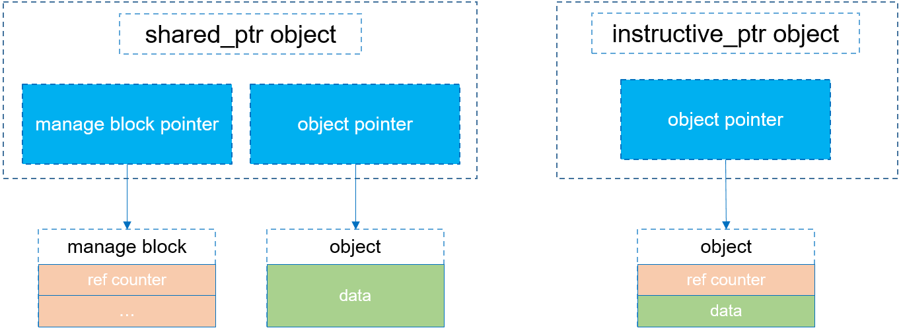

# intrusive_pt (侵入式智能指针) 介绍

## 引言
内存管理是C++一个重要的话题，其中，智能指针能够自动执行堆内存的释放，给我们在资源管理上带来很多便利。

STL和boost提供了多种智能指针，这里只介绍资源共享型的智能指针`boost::intrusive_ptr<T>`，并跟`std::shared_ptr<T>`做比较，分析二者的异同。

## intrusive_pt是什么？
intrusive_ptr, a pointer to objects with an embedded reference count.

顾名思义，`boost::intrusive_ptr<T>`意为侵入式指针，它的实现包括必要的两部分：智能指针模板和引用计数模板类，智能指针模板类只有一个用于保存对象的指针变量，而指针所指向的对象类型`T`需要从上述引用计数模板类继承，对象的引用计数直接保存在对象中。因为多个智能指针指向的对象是同一个，所以引用计数也是相同的。

非侵入式智能指针的实现则不同。`std::shared_ptr<T>`就是非侵入式的，它的实现完全放在智能指针模板里。模板类同时存有指向资源类对象的指针变量和引用计数变量。两个变量是所有的智能指针对象共享的，所以通过指针保存（这是一种实现方式）。

## 官方资料
相关资料：
- boost官方文档中关于intrusive_ptr的描述：[intrusive_ptr: Managing Objects with Embedded Counts](https://www.boost.org/doc/libs/1_80_0/libs/smart_ptr/doc/html/smart_ptr.html#intrusive_ptr)
- 源码：[boost::intrusive_ptr](https://github.com/boostorg/smart_ptr/blob/develop/include/boost/smart_ptr/intrusive_ptr.hpp)
- 源码：[boost::intrusive_ref_counter](https://github.com/boostorg/smart_ptr/blob/develop/include/boost/smart_ptr/intrusive_ref_counter.hpp)

总结一下上述文档中提及的关键点：
- `intrusive_ptr`是一种智能指针，指向有引用计数的对象；因此，boost同时提供了一个引用计数能力的基类`intrusive_ref_counter`，`intrusive_ptr`指向的对象需要派生自`intrusive_ref_counter`；
- 

总所周知，std::shared_ptr 也是一个具有引用计数能力的智能指针，二者有哪些区别呢？
- 使用方式上：`intrusive_ptr`必须指向有引用计数能力的对象，`shared_ptr`自己管理引用计数，它可以指向任何对象，使用上更加灵活；
- 内存模型：

摘取 boost Documents 中的一段话：
> The main reasons to use intrusive_ptr are:
> - Some existing frameworks or OSes provide objects with embedded reference counts;
> - The memory footprint of intrusive_ptr is the same as the corresponding raw pointer;
> - intrusive_ptr<T> can be constructed from an arbitrary raw pointer of type T*.
> 
> As a general rule, if it isn’t obvious whether intrusive_ptr better fits your needs than shared_ptr, try a shared_ptr-based design first.

相比非侵入式智能指针，它的好处是：1、一个资源对象无论被多少个侵入式智能指针包含，从始至终只有一个引用计数变量，不需要在每一个使用智能指针对象的地方都new一个计数对象，这样子效率比较高，使用内存也比较少，也比较安全；2、因为引用计数存储在对象本身，所以在函数调用的时候可以直接传递资源对象地址，而不用担心引用计数值丢失（非侵入式智能指针对象的拷贝，必须带着智能指针模板，否则就会出现对象引用计数丢失）。坏处是：1、资源类必须有引用计数变量，并且该变量的增减可以被侵入式智能指针模板基类操作，这显得麻烦；2、如果该类并不想使用智能指针，它还是会带着引用计数变量。

## intrusive_pt如何实现？

## intrusive_pt怎么用？

